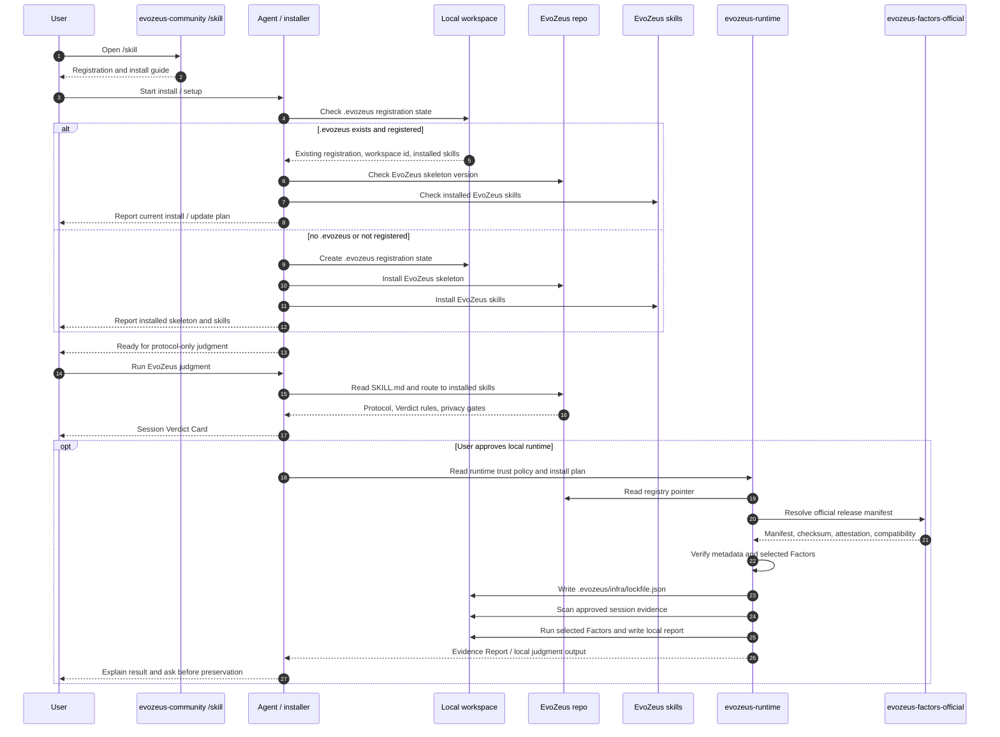

<h1 align="center">
  &nbsp;&nbsp;EvoZeus（宙斯）&nbsp;&nbsp;
</h1>

<p align="center">
  <strong>English</strong> · <a href="docs/README.zh-CN.md">简体中文</a>
</p>

<p align="center">
  
</p>

<p align="center">
  <a href="#start-here">Start Here</a> ·
  <a href="#what-evozeus-manages">Managed Assets</a> ·
  <a href="#use-paths">Use Paths</a> ·
  <a href="#contribution-quick-path">Contribution</a> ·
  <a href="#docs-by-goal">Docs by Goal</a> ·
  <a href="docs/README.md">Full Docs</a>
</p>

##  Put Agent Sessions on the judgment bench.

**Evidence decides what should be preserved, fixed, promoted, or rejected.**

EvoZeus is a judgment layer for Agent Sessions. It does not score agents, and it does not treat Skill creation as the only goal. It manages evidence, Cases, Verdicts, and reusable artifacts from real sessions.

EvoZeus also defines a software pattern: **Skill Driven Software (SDS)**. In SDS, software behavior is shaped by code, scenario skills, factors, rules, reports, and runtime surfaces together.

> Origin: EvoZeus came from a retrospective between [Anthony](https://github.com/HaodiFan) and [Neil](https://github.com/orgs/MetaInFLow/people/Neillan96) after a hackathon that did not go well.

##  Start Here

Copy this into your agent:

```text
Read this repository's SKILL.md and judge the current Agent Session with EvoZeus. First output only a Session Verdict Card. Do not write local files or submit to GitHub.
```

If you arrived from `https://evozeus-community.vercel.app/skill`, this is the guided registration / install step. Runtime, default official factors, local scans, report files, and GitHub contribution happen only after explicit user approval.
In that path, read [EvoZeus-Install Registration](skills/evozeus-install-registration/SKILL.md) before running any judgment.

##  Registration / Install Sequence

The community `/skill` page should guide registration and installation. It is not the runtime judgment itself. A local install must register the workspace, install the EvoZeus skeleton, and install the EvoZeus skills before optional runtime scanning or Factor execution.



| Step | Current state |
| --- | --- |
| Community `/skill` | Should route users to registration and install |
| `.evozeus` registration | Install path must check existing registration before creating or updating state |
| EvoZeus install | Should install the protocol skeleton and EvoZeus skills |
| Protocol-only judgment | Can still produce a response-only Session Verdict Card |
| Runtime approval | Required before scanning, installing, networking, or writing `.evozeus/` |
| Runtime implementation | Lives in `evozeus-runtime`; scanner / runner prototype is not a default user command |
| Official Factors | Must come through registry pointer + manifest + checksum + attestation |
| Local output | Only after approval: `.evozeus/infra/lockfile.json`, local evidence index, Markdown / JSON / HTML report |

##  What EvoZeus Manages

Software development manages `code -> issue -> PR -> review -> merge`.

EvoZeus manages:

```text
Session -> Evidence -> Case -> Verdict -> Artifact -> Library
```

| Term | Meaning |
| --- | --- |
| Session | One real agent execution |
| Evidence | The smallest proof that supports a judgment |
| Case | A finding waiting for judgment |
| Verdict | The evidence-backed decision for a Case |
| Artifact | The executable or reusable asset created after a Verdict |
| Library | The reusable public asset collection |

Every Verdict should become an Artifact:

| Verdict | Artifact |
| --- | --- |
| `Promote to Skill` | Skill |
| `Extract Factor` | Factor |
| `Keep as Habit` | Habit |
| `Fix Environment` | Environment Rule |
| `Reject Pattern` | Rejected Pattern |
| `Preserve` | Accepted Case |
| `Open Case` | Pending Case |

##  Use Paths

EvoZeus is currently an **agent-readable protocol repository**, not a stable CLI product. This README keeps the shortest paths here; the full rules live in docs and skills.

| Goal | Start here | Output |
| --- | --- | --- |
| Register and install EvoZeus | [EvoZeus-Install Registration](skills/evozeus-install-registration/SKILL.md) | `.evozeus` registration state, skeleton, skills inventory |
| Judge one Agent Session | [SKILL.md](SKILL.md) | Session Verdict Card |
| Choose the right work scenario | [EvoZeus-Skill Index](skills/index/SKILL.md) | `EvoZeus-Development` / `EvoZeus-Community Contribution` / `EvoZeus-Reporting` / `EvoZeus-Runtime Routing` |
| Develop EvoZeus itself | [EvoZeus-Development](skills/evozeus-development/SKILL.md) | small issue/branch/PR |
| Contribute a Case or Candidate | [CONTRIBUTING.md](CONTRIBUTING.md) | redacted Case / Candidate PR |
| Review PR rules | [docs/governance/pr-guidelines.md](docs/governance/pr-guidelines.md) | proof-backed PR |
| Understand the semantic model | [docs/reference/ontology.md](docs/reference/ontology.md) | Candidate / Evidence / Verdict boundaries |

##  Safety Defaults

The default EvoZeus path is low-permission, reviewable, and reversible.

- **Zero-install entry**: reading `SKILL.md` should not install packages.
- **Skeleton first**: the first pass outputs a Session Verdict Card in the response and does not write `.evozeus/` state.
- **Local-first evidence**: raw sessions stay local by default and do not go into public PRs.
- **Redacted public artifacts**: public Cases, Candidates, and Reports must be redacted first.
- **Markdown/JSON first**: base reports and schemas do not depend on dashboards, scanners, or cloud services.
- **Opt-in runtime packs**: scanner, factor code, MCP, LLM, and visualization packs must be explicitly enabled.
- **User-approved contribution**: only after user approval should an agent check `gh` and create an issue or PR.

##  Contribution Quick Path

The main path is agent-assisted, but merge authority stays with maintainers:

```text
Local Evidence Report -> Agent Review -> Case Draft -> User Approval -> PR -> Maintainer Review
```

Before development or PR review, run:

```bash
python3 scripts/check_pr_ready.py
git diff --check
```

Minimal Case shape:

```yaml
session_id: redacted-session-id
agent_runtime: codex | claude | cursor | other
case_type: preserve | promote | fix | reject | open
evidence: redacted command output, diff, tool trace, or report excerpt
proposed_verdict: Preserve | Promote to Skill | Extract Factor | Keep as Habit | Fix Environment | Reject Pattern | Open Case
privacy_note: what was removed or generalized
```

GitHub automation is dry-run by default: labeler, proof gate, privacy scan, dirty PR check, queue guard, and Candidate schema check may label and update marker comments, but they must not approve, merge, promote core Candidates, or auto-close PRs.

##  Docs by Goal

| Need | Read |
| --- | --- |
| Docs home | [docs/README.md](docs/README.md) |
| Evidence levels | [docs/reference/evidence-grading.md](docs/reference/evidence-grading.md) |
| Review contract | [docs/reference/review-contract.md](docs/reference/review-contract.md) |
| Verdict types | [docs/reference/verdicts.md](docs/reference/verdicts.md) |
| Verdict Card | [docs/reference/verdict-card.md](docs/reference/verdict-card.md) |
| Report templates | [docs/reference/report-templates.md](docs/reference/report-templates.md) |
| Candidate Schema | [schemas/candidate.schema.json](schemas/candidate.schema.json) |
| Privacy and redaction | [docs/governance/privacy-and-redaction.md](docs/governance/privacy-and-redaction.md) |
| PR routing state machine | [docs/governance/pr-routing-policy.md](docs/governance/pr-routing-policy.md) |
| Factor registry governance | [docs/governance/factor-registry-governance.md](docs/governance/factor-registry-governance.md) |
| Launch readiness criteria | [docs/governance/launch-readiness-criteria.md](docs/governance/launch-readiness-criteria.md) |
| Labels and protected paths | [docs/governance/labels.md](docs/governance/labels.md), [docs/governance/protected-paths.md](docs/governance/protected-paths.md) |

##  What Exists Today

| Area | Status |
| --- | --- |
| Protocol Surface | `SKILL.md`, scenario skills, Verdicts, Case templates, privacy gates |
| Ontology Layer | Candidate taxonomy, evidence grading, negative patterns, review contract |
| Developer Workflow | branch rules, PR templates, dry-run governance gates, pre-submit checks |
| Public Examples | redacted Case, Evidence Report, valid/invalid Candidate examples |
| Factor Surface | public Factor Candidate intake and registry pointers; executable packs live outside this repo |

Planned but not stable yet:

- Local Runtime: `.evozeus/` local state, SQLite registry, Markdown/JSON report
- Community Library: Cases, Factor references, Habits, Environment Rules, Rejected Patterns
- CLI / TUI / browser companion

Not promised:

- automatic raw session upload
- default scanner / chart / MCP / cloud client installation
- automatic PR creation
- large-scale benchmark

##  License

MIT. See [LICENSE](LICENSE).
