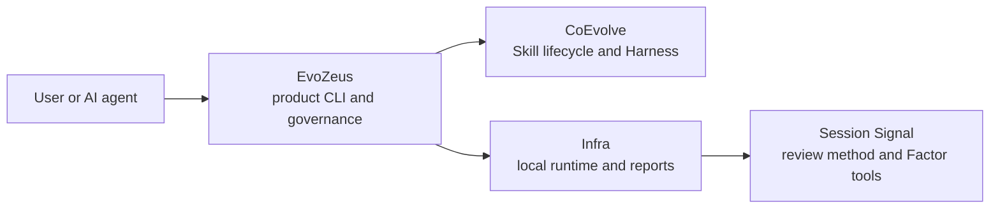

<h1 align="center">
  
  EvoZeus
  
</h1>

<p align="center"><strong>The judgment and evolution layer for AI agent work.</strong></p>

<p align="center">
  <a href="https://github.com/MetaInFLow/EvoZeus/actions/workflows/ci.yml"></a>
  <a href="https://github.com/MetaInFLow/EvoZeus/releases/latest"></a>
  <a href="LICENSE"></a>
  
</p>

<p align="center">
  <strong>English</strong> · <a href="docs/README.zh-CN.md">简体中文</a> ·
  <a href="#quick-start">Quick Start</a> · <a href="docs/README.md">Documentation</a> ·
  <a href="CONTRIBUTING.md">Contributing</a>
</p>

EvoZeus turns evidence from real agent sessions into reviewable decisions and reusable artifacts. It provides one local CLI for product discovery, Stable/UAT channels, session review, insights, preservation, and governed Skill evolution.


```mermaid
flowchart LR
    U["User or AI agent"] --> E["EvoZeus\nproduct CLI and governance"]
    E --> C["CoEvolve\nSkill lifecycle and Harness"]
    E --> I["Infra\nlocal runtime and reports"]
    I --> S["Session Signal\nreview method and Factor tools"]
```

## Table of contents

- [Quick start](#quick-start)
- [Product family](#product-family)
- [What EvoZeus does](#what-evozeus-does)
- [Core model](#core-model)
- [Version channels](#version-channels)
- [Safety by default](#safety-by-default)
- [Documentation](#documentation)
- [Contributing](#contributing)
- [License](#license)

## Quick start

### 1. Install the latest Stable release

Download and extract the archive from [GitHub Releases](https://github.com/MetaInFLow/EvoZeus/releases/latest), then preview the local installation:

```console
$ node scripts/evozeus-install.mjs
```

Apply the installation only after reviewing the plan:

```console
$ node scripts/evozeus-install.mjs --approve-write
```

### 2. Inspect the active product

```console
$ ~/.evozeus/bin/evozeus version --json
$ ~/.evozeus/bin/evozeus doctor --json
```

### 3. Choose a capability

```console
$ ~/.evozeus/bin/evozeus features --json
$ ~/.evozeus/bin/evozeus capabilities --json
```

`features` is the product menu. `capabilities` exposes risk, permission, input, and output facts before an operation runs.

## Product family

EvoZeus is the canonical product and governance repository. The product manifest pins the following user-visible components to exact releases or UAT commits:

| Repository | Responsibility | User entry |
| --- | --- | --- |
| **[MetaInFLow/EvoZeus](https://github.com/MetaInFLow/EvoZeus)** | Product CLI, feature routing, Stable/UAT channels, governance, and release assembly | `~/.evozeus/bin/evozeus` |
| **[MetaInFLow/EvoZeus-CoEvolve](https://github.com/MetaInFLow/EvoZeus-CoEvolve)** | Lessons, target-Skill lifecycle, Harness upgrades, and governed evolution | `evozeus coevolve ...` |
| **[MetaInFLow/EvoZeus-infra](https://github.com/MetaInFLow/EvoZeus-infra)** | Opt-in local scanner, Factor runner, ledger, and report runtime | Routed by EvoZeus or `evozeus-runtime` |
| **[MetaInFLow/EvoZeus-session-signal-skill](https://github.com/MetaInFLow/EvoZeus-session-signal-skill)** | Session Signal method and official Factor tools | Used by the runtime during approved review |

See the canonical [repository topology](docs/governance/repository-topology.md) for ownership and change routing. Local multi-repo workspaces and historical coordination repositories do not define installed product versions.

## What EvoZeus does

| Goal | Command or entry | Result |
| --- | --- | --- |
| Inspect the installed product | `evozeus version --json` | Active channel, product version, manifest, and component commits |
| Check local readiness | `evozeus doctor --json` | Health verdict, missing components, and repair route |
| Review one explicit session | `evozeus review session --input <path\|-> --json` | Evidence-backed Session Verdict Card |
| Plan or run local insights | `evozeus insights ...` | Permission-aware runtime plan or local report |
| Preserve a reusable artifact | `evozeus preserve draft --from-report <path> --json` | Redacted local contribution draft |
| Attach governed evolution | `evozeus coevolve attach --target <path\|url> --json` | CoEvolve handoff plan |
| Update or switch channels | `evozeus update` / `evozeus channel use` | Transactional Stable or single-UAT state change |

Run `~/.evozeus/bin/evozeus --help` for the full command surface.

## Core model

EvoZeus manages the path from work evidence to a reusable outcome:

```text
Session -> Evidence -> Case -> Verdict -> Artifact -> Library
```

| Object | Meaning |
| --- | --- |
| **Session** | One real agent execution |
| **Evidence** | The smallest proof that supports a judgment |
| **Case** | A finding waiting for review |
| **Verdict** | An evidence-backed decision |
| **Artifact** | A reusable Skill, Factor, rule, pattern, or accepted Case |
| **Library** | The reviewed collection of reusable artifacts |

EvoZeus also defines **Skill Driven Software (SDS)**: software behavior shaped jointly by code, scenario Skills, Factors, rules, reports, and runtime surfaces.

## Version channels

| Channel | Source of truth | Intended use |
| --- | --- | --- |
| **Stable** | Signed GitHub Release assets and `evozeus-product-stable.json` | Normal use |
| **UAT** | The single replaceable `uat/current` manifest | Acceptance testing before promotion |
| **Development** | Contributor branches and PRs | Repository development only |

Stable and UAT use separate install roots and runtime state. A new UAT candidate replaces the previous UAT; rollback history remains available. See the [release and promotion policy](docs/governance/release-and-promotion-policy.md).

## Safety by default

- Raw sessions remain local unless the user approves a specific transfer.
- Scanning, network access, package installation, file writes, and GitHub changes require explicit approval.
- Public Cases and reports must remove secrets, customer data, and private session content.
- Update operations validate manifests, commits, required paths, and smoke checks before activation.
- Stable and UAT never share mutable runtime state.

Read the [privacy and redaction policy](docs/governance/privacy-and-redaction.md) before contributing evidence.

## Documentation

| Need | Start here |
| --- | --- |
| Documentation home | [docs/README.md](docs/README.md) |
| Product and repository topology | [docs/governance/repository-topology.md](docs/governance/repository-topology.md) |
| Concepts and ontology | [docs/reference/ontology.md](docs/reference/ontology.md) |
| Evidence grading | [docs/reference/evidence-grading.md](docs/reference/evidence-grading.md) |
| Review contract | [docs/reference/review-contract.md](docs/reference/review-contract.md) |
| Version and promotion rules | [docs/governance/release-and-promotion-policy.md](docs/governance/release-and-promotion-policy.md) |
| Scenario Skill index | [skills/index/SKILL.md](skills/index/SKILL.md) |
| Changelog | [CHANGELOG.md](CHANGELOG.md) |

## Contributing

Contributions are welcome when they include reviewable evidence and respect the privacy boundary. Start with [CONTRIBUTING.md](CONTRIBUTING.md), then run:

```console
$ npm ci
$ npm test
$ python3 scripts/check_pr_ready.py --base origin/main
$ git diff --check
```

Security reports should follow [SECURITY.md](SECURITY.md).

## License

EvoZeus is available under the [MIT License](LICENSE).
