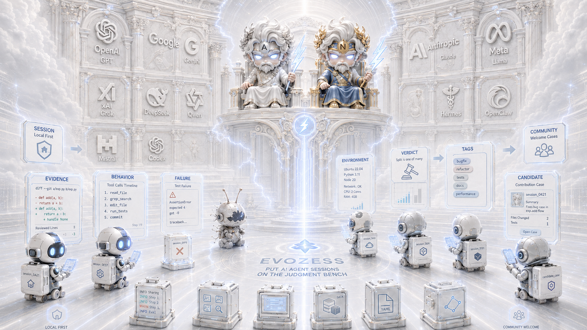
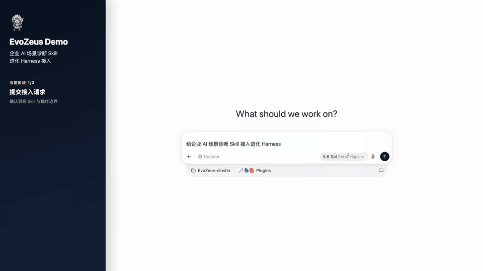
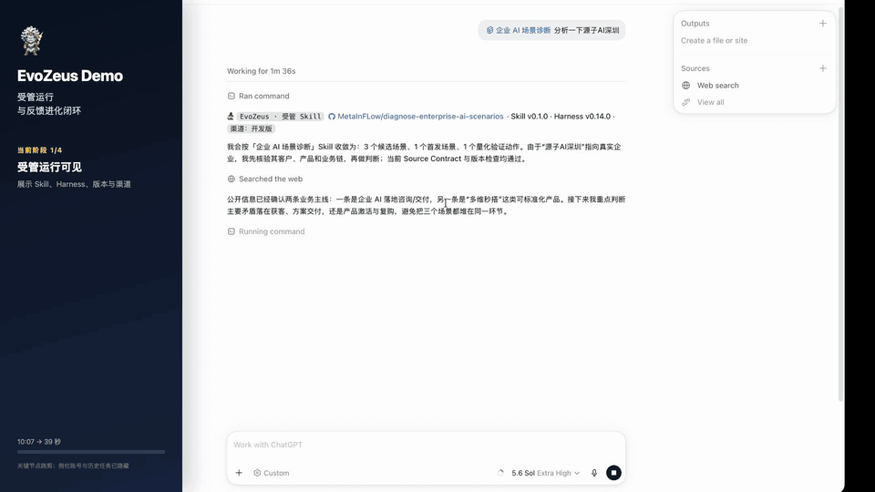

<h1 align="center">
  <br>
  EvoZeus（宙斯）
</h1>

<p align="center">
  <strong>把真实 Agent 工作转化为经过验证的持续改进。</strong>
</p>

> Origin：宙斯的概念诞生于一次不太成功的黑客松之后，[Anthony](https://github.com/HaodiFan) 和 [Neil](https://github.com/orgs/MetaInFLow/people/Neillan96) 两个人的一次复盘。

<p align="center">
  <strong>简体中文</strong> ·
  <a href="README.en.md">English</a> ·
  <a href="#适用场景">适用场景</a> ·
  <a href="#观看演示">演示</a> ·
  <a href="#安装-evozeus">安装</a> ·
  <a href="#evozeus-何时会显示标记">可见标记</a> ·
  <a href="#工作方式">工作方式</a> ·
  <a href="#安全边界">安全</a> ·
  <a href="CHANGELOG.md">Changelog</a>
</p>

<p align="center">
  <a href="https://github.com/MetaInFLow/EvoZeus/releases"></a>
  <a href="https://github.com/MetaInFLow/EvoZeus/actions/workflows/ci.yml"></a>
  <a href="LICENSE"></a>
</p>

<p align="center">
  
</p>

EvoZeus 复盘真实 Agent 任务中发生了什么，识别值得改善下一次执行的 Lesson，并把用户确认后的变化转化为可复用、可验证、可发布的改进。它适用于正在构建和交付 Skill、Plugin、Agent Workflow 与其他 Skillware 的团队。

```text
真实使用 → 证据 → 判断 → Lesson → 用户确认 → 修复验证 → 发布
```

## 适用场景

EvoZeus 当前优先解决两类高频问题：产品需要尽快进入真实使用，以及交付后的 Skill 需要持续吸收客户反馈。

| **OPC · 从快速 MVP 到工程化产品** | **FDE · 从客户交付到持续迭代** |
| --- | --- |
| **适合谁**<br>借助 Agent 独立构建产品的 One Person Company。 | **适合谁**<br>向客户交付 Skill 的 Forward Deployed Engineer 与项目团队。 |
| **核心问题**<br>MVP 可以快速上线，但真实用户暴露的问题容易散落，产品长期停留在“能跑”的状态。 | **核心问题**<br>Skill 进入客户工作流后，反馈分散在群聊、私信、演示与验收中，难以追踪和复用。 |
| **改进链路**<br>`快速 MVP → 真实使用 → Lesson → 修复 → UAT → Stable` | **改进链路**<br>`交付 Skill → 客户使用 → 确认 Lesson → Repo 修改 → 客户 UAT → 发布` |
| **EvoZeus 如何帮助**<br>① 先让 MVP 上线，在真实场景中暴露边界。<br>② 把用户纠正和失败案例提炼成可复用 Lesson。<br>③ 区分产品、Skill、环境与执行问题。<br>④ 让确认后的变化进入验证、唯一 UAT 和正式发布。 | **EvoZeus 如何帮助**<br>① 为独立 Skill Repo 接入受治理的进化 Harness。<br>② 在正常业务对话中提示可复用 Lesson。<br>③ 记录前先确认并脱敏，raw session 默认留在本地。<br>④ 把反馈、修改、验证、UAT、发布和回滚连成一条链。 |
| **结果**<br>保留 MVP 的上线速度，逐步获得可验证、可维护、可回滚的工程质量。 | **结果**<br>把一次性交付转化为可持续维护、可验收、可交接的 Skill 产品。 |

## 观看演示

下面两段短视频展示完整链路：先让一个已有 Skill 进入可维护生命周期，再把一次用户不满意转化为团队可检查、可授权的改进输入。

### 1. 让 Skill 进入受管生命周期

在保留业务行为的前提下，为独立 Skill Repo 补齐源头、版本、验证、反馈和发布治理。

<p align="center">
  
</p>

<sub>50 秒自动循环演示 · [下载 MP4 原视频](assets/demos/skill-evolution-harness.mp4?raw=1)</sub>

### 2. 把不满意转化为可追踪改进

保持正常聊天简洁；发现可复用 Lesson 后先说明目标 Repo、记录载体、影响范围和写入边界，再征得授权创建可评审的 Feedback Issue。

<p align="center">
  
</p>

<sub>39 秒自动循环演示 · [下载 MP4 原视频](assets/demos/managed-feedback-loop.mp4?raw=1)</sub>

## 安装 EvoZeus

官网负责完整安装与注册旅程。在兼容的 Agent 宿主中粘贴下面一行：

```text
加入 EvoZeus: https://evozeus-community.vercel.app/skill
```

[官网 Install Skill](https://evozeus-community.vercel.app/skill) 会：

1. 解析最新不可变 Stable Release，并校验正式安装物；
2. 说明本地写入和联网行为，在安装与注册前取得批准；
3. 自动识别 Codex、Claude Code 或两者，并注册唯一的 `evozeus` Plugin；
4. 同步 Runtime 与 Plugin 到同一 Stable/UAT 渠道，启用渠道内自动更新，完成 Doctor 后提示开启新会话。

官网是唯一公开安装交接入口，README 不复制第二套安装命令。Stable 健康后，用户可以单独选择是否进入唯一 UAT。

## 用真实 Demo Skill 体验

[企业 AI 场景地图 Skill](https://github.com/MetaInFLow/Enterprise-ai-scenario-map-skill) 是理解 EvoZeus 用法的业务 Demo。它会调研企业、生成 30 个以上 AI 场景、完成优先级判断并给出落地路径。

```text
使用企业 AI 场景地图 Skill，为一家 B2B 软件服务公司生成标准版 AI 场景地图。
```

一次完整体验包含四个时刻：

| 时刻 | 业务动作 | EvoZeus 动作 |
| --- | --- | --- |
| 1. 运行 | 使用 Demo Skill 生成企业 AI 场景地图 | 展示产品渠道并识别目标 Skill；目标 Repo 已接入 Harness 时同步显示其身份 |
| 2. 纠正 | 指出证据不足、交付格式缺失等具体问题 | 先完成业务纠正，再总结一条可复用 Lesson |
| 3. 确认 | 决定是否记录 Lesson | 只有用户确认后才创建 Skill Feedback Issue |
| 4. 进化 | 单独授权修改目标 Repo | 让已批准变化进入 Design、PR、验证、UAT 和 Release |

Demo 解释产品如何使用；安装和注册始终走上方官网 `/skill` 入口。

## 开始使用

完成安装后，可以直接表达目标：

```text
复盘这次 Agent 执行，找出值得保留、修复或进化的内容。
```

```text
把这条已确认的 Lesson 保存为可追踪的改进。
```

```text
检查 EvoZeus 的 stable/UAT 状态，并告诉我唯一下一步。
```

EvoZeus 在正常聊天中给出结果。生命周期事件使用紧凑标记：

```text
🧙 EvoZeus · 捕捉到一条 Lesson｜版本检查不应阻断用户的真实任务｜拟记录到：MetaInFLow/EvoZeus · GitHub Feedback Issue｜影响范围：版本检查协议｜写入边界：仅创建脱敏 Issue；不修改代码、不创建 PR。要按此记录吗？
```

正常 Lesson 提示不会输出内部 JSON，并会在用户确认前说明准确落点与授权边界。

## EvoZeus 何时会显示标记

这些是 EvoZeus 的完整用户可见生命周期标记。它们出现在正常聊天中，用来说明 EvoZeus 何时介入、当前处于哪个阶段、是否已经获得验证；普通分析和每次工具调用不会刷标记。

| 你看到的标记 | 代表什么 | 什么时候出现 |
| --- | --- | --- |
| `🧙 EvoZeus · 已启动｜复盘这次 Agent 执行` | EvoZeus 已被显式调用 | 开始一次 EvoZeus 任务 |
| `👁️ EvoZeus · 受管运行｜企业场景地图 Skill · UAT` | 当前 Skillware 已进入受管生命周期 | Repo、Harness、渠道身份均已核验 |
| `🧙 EvoZeus · 捕捉到一条 Lesson｜证据不足时不能直接报完成｜拟记录到：owner/example-skill · GitHub Feedback Issue｜影响范围：任务完成门禁｜写入边界：仅创建脱敏 Issue；不修改代码、不创建 PR。要按此记录吗？` | 发现了值得复用的改进 | 业务结果完成且记录落点明确后，记录前先询问 |
| `📝 EvoZeus · Lesson 已记录｜Feedback Issue #12` | 已按授权保存 Lesson | 本地记录或 Issue 创建成功后 |
| `🔐 EvoZeus · 等待确认｜创建 Feedback Issue` | 下一动作会写入或影响外部系统 | 需要新的具体授权时 |
| `🧭 EvoZeus · 版本状态｜Stable v0.4.0 → UAT v0.4.1` | 正在判断安装或渠道变化 | 对齐、升级、切换前 |
| `🧭 EvoZeus · 发现更新｜Stable v0.4.0 → v0.4.1` | 当前订阅渠道有新版本 | 自动检查发现变化后 |
| `🛠️ EvoZeus · 自动更新中｜正在对齐Plugin、Runtime、Session Signal与CoEvolve` | 产品级更新事务已开始 | 下载与验证期间 |
| `✅ EvoZeus · 自动更新完成｜Stable v0.4.1 · 新会话加载Plugin` | 新产品已通过验证并切换 | 自动更新成功后 |
| `🛡️ EvoZeus · 自动更新失败｜继续使用Stable v0.4.0` | 已保留上一验证版本 | 更新或验证失败后 |
| `🛠️ EvoZeus · 进化中｜example-skill · 修复验收门禁` | 已开始实施获批修改 | 修改授权已取得后 |
| `🧪 EvoZeus · UAT 就绪｜example-skill · abc1234` | 唯一 UAT 候选已经通过门禁 | 测试和候选更新完成后 |
| `🚀 EvoZeus · 已发布｜example-skill · v1.2.0` | Stable Release 已真实存在 | 正式发布完成后 |
| `↩️ EvoZeus · 已回滚｜Stable v1.1.0` | 已恢复上一份可用版本 | 回滚并通过 Doctor 后 |
| `🛡️ EvoZeus · 暂停｜缺少可脱敏的验证证据` | 当前安全或证据条件不足 | 继续执行会越过边界时 |
| `✅ EvoZeus · 已验证｜Plugin、Runtime 与渠道一致` | 声明完成所需检查已通过 | 最终交付前 |

标记只反映真实状态：计划不会显示成完成，UAT 不会显示成 Stable。完整合同见[用户可见生命周期标记](docs/reference/user-visible-events.md)。

启动方式取决于 Agent 宿主：

| 宿主 | 行为 |
| --- | --- |
| Claude Code plugin | 内置 `SessionStart` 适配器加载 Lesson 检查合同并检查当前产品渠道；已是最新时保持安静，只在更新状态变化时显示标记 |
| Codex plugin | 通过用户显式请求或语义匹配选择 EvoZeus；进入 EvoZeus 或 CoEvolve 受管 Skill 时检查版本 |

两种宿主都先完成用户任务，再询问是否记录 Lesson。

## 工作方式

1. **复盘**：读取用户放入范围的会话、文件、diff、报告或明确批准的本地来源。
2. **判断**：把发现路由为 Preserve、Promote to Skill、Keep as Habit、Fix Environment、Reject Pattern 或 Open Case。
3. **确认**：发现可复用 Lesson 时，用一句话总结并询问是否记录。
4. **改进**：把确认后的 Lesson 转化为可检查产物；独立 Skillware Repo 可接入 [EvoZeus CoEvolve](https://github.com/MetaInFLow/EvoZeus-CoEvolve)。

## 产品包含什么

EvoZeus 是一个本地产品和一个版本化发布：

| 能力面 | 作用 |
| --- | --- |
| Agent plugin | 自然语言入口与任务路由 |
| 用户 Skills | 复盘、Lesson 记录、Repo 进化、版本维护 |
| 产品 CLI | Stable/UAT 对齐、Doctor、更新与回滚 |
| 内置 Runtime | 本地证据处理与报告 |
| 内置 Session Signal pack | 官方复盘信号与 Factor tools |
| 可选 CoEvolve | 独立 Skillware Repo 的进化生命周期 |

Runtime 与 Session Signal 是主仓内部模块，随 EvoZeus 产品版本一起发布，用户无需分别升级。

## Stable 与唯一 UAT

- `stable` 是不可变正式 Release。
- `uat` 是唯一可覆盖的测试候选。
- Stable 和 UAT 都会在运行入口自动检查并更新，默认最多每小时访问一次远端清单。
- 自动更新始终留在当前渠道；Stable 不会自动切到 UAT。
- UAT 修复覆盖当前候选，不产生第二个用户可见 UAT。
- Stable 与 UAT 的代码和本地状态隔离。
- 正式发布使用已经验证的同一份 UAT 源码。
- Codex/Claude 中始终只有一个活动 `evozeus` Plugin；切换渠道会覆盖重装它，不会生成第二个 UAT Plugin。

已安装的 Stable `v0.4.0` 及更旧版本需要一次显式对齐进入 `v0.4.1+`，之后的同渠道更新才会自动运行。已激活自动刷新的 `v0.4.0` UAT 可以直接从覆盖后的 `uat/current` 完成迁移。

用户批准后，官网安装流程调用同一个对齐事务：

```bash
evozeus align --channel stable --host auto --approve-write --json
```

进入测试时把 `stable` 改为 `uat`。普通用户不需要手工维护 marketplace、worktree 或 Plugin 缓存。

详细语义见 [ADR-0003](docs/decisions/ADR-0003-stable-single-uat-channel-model.md)；产品架构见 [ADR-0005](docs/decisions/ADR-0005-plugin-first-monorepo-and-repo-scoped-harness.md)。

## Repo 进化边界

进化 Harness 的治理单位是 Git Repo，因为 Issue、PR、Owner、UAT、Release 和回滚都在这个边界上发生。

- 一个独立 Git Repo 最多拥有一个根 Harness；
- package、pack、app 和 Skill 目录继承所在 Repo Harness；
- CI 拒绝嵌套 Harness；
- Harness 升级和推送需要目标 Repo 已验证的 `ADMIN` 权限。

完整规则见 [Harness 边界策略](docs/governance/harness-boundary-policy.md)。

## 安全边界

- raw private session 默认保留在本地。
- 不自动上传会话。
- 首次安装授权包含当前渠道内的已验证自动更新；渠道切换、GitHub 修改和外部上传仍需单独确认。
- 用户可在 `~/.evozeus/update-policy.json` 关闭自动更新或调整检查间隔。
- 公开产物必须移除 secret、客户数据、私有路径、无关身份和未发布代码。
- 运行历史 Skill 会调用已安装启动器检查当前渠道；验证失败时继续使用上一版。

## 维护者入口

```bash
npm ci
npm test
npm run test:python
python3 scripts/check_pr_ready.py --allow-cross-layer
```

关键文档：

- [架构与迁移设计](docs/design/active/design_doc-v0.5-plugin-monorepo.md)
- [Repo 拓扑](docs/governance/repository-topology.md)
- [发布策略](docs/governance/release-and-promotion-policy.md)
- [Plugin 用户入口](skills/using-evozeus/SKILL.md)
- [维护者 Skills](maintainer/skills/index/SKILL.md)
- [贡献指南](CONTRIBUTING.md)
- [安全策略](SECURITY.md)

## 相关 Repo

- [MetaInFlow/EvoZeus-CoEvolve](https://github.com/MetaInFLow/EvoZeus-CoEvolve)：面向独立 Skillware Repo 的可选进化扩展与 Harness SDK。

## License

MIT，详见 [LICENSE](LICENSE)。
