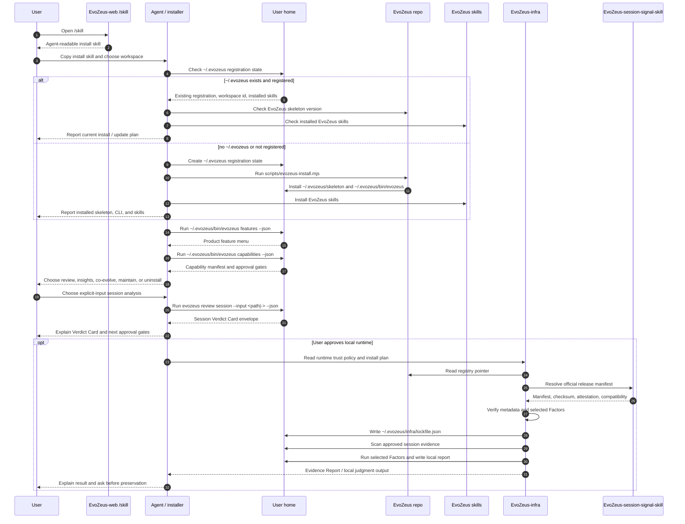

<h1 align="center">
  &nbsp;&nbsp;EvoZeus（宙斯）&nbsp;&nbsp;
</h1>

<p align="center">
  <strong>English</strong> · <a href="docs/README.zh-CN.md">简体中文</a>
</p>

<p align="center">
  
</p>

<p align="center">
  <a href="#start-here">Start Here</a> ·
  <a href="#what-evozeus-manages">Managed Assets</a> ·
  <a href="#use-paths">Use Paths</a> ·
  <a href="#contribution-quick-path">Contribution</a> ·
  <a href="#docs-by-goal">Docs by Goal</a> ·
  <a href="docs/README.md">Full Docs</a>
</p>

##  Put Agent Sessions on the judgment bench.

**Evidence decides what should be preserved, fixed, promoted, or rejected.**

EvoZeus is a judgment layer for Agent Sessions. It does not score agents, and it does not treat Skill creation as the only goal. It manages evidence, Cases, Verdicts, and reusable artifacts from real sessions.

EvoZeus also defines a software pattern: **Skill Driven Software (SDS)**. In SDS, software behavior is shaped by code, scenario skills, factors, rules, reports, and runtime surfaces together.

> Origin: EvoZeus came from a retrospective between [Anthony](https://github.com/HaodiFan) and [Neil](https://github.com/orgs/MetaInFLow/people/Neillan96) after a hackathon that did not go well.

##  Start Here

Copy this into your agent:

```text
Run ~/.evozeus/bin/evozeus features --json, show the available EvoZeus product features, then use ~/.evozeus/bin/evozeus capabilities --json for the selected feature's risk and permission facts. Do not scan local sessions, write files, or submit to GitHub unless the user explicitly approves the specific action.
```

If you arrived from `https://evozeus-community.vercel.app/skill`, this is the agent-readable install skill handoff. The user copies the install skill to a local agent; the agent asks before local writes, then installs or reconciles `~/.evozeus/skeleton`, `~/.evozeus/bin/evozeus`, and EvoZeus skills. Runtime, default official factors, local scans, report files, wrapper writes, and GitHub contribution happen only after explicit user approval.
In that path, read [EvoZeus-Install Registration](skills/evozeus-install-registration/SKILL.md) before running any judgment, co-evolution, update, or uninstall action.

##  Registration / Install Sequence

The community `/skill` page should return an install skill, not a normal installer download. It is not the runtime judgment itself. A local install must register the user-level EvoZeus home, install `~/.evozeus/skeleton`, install `~/.evozeus/bin/evozeus`, and install the EvoZeus skills before optional runtime scanning, Factor execution, or static Skill wrapping. EvoZeus stays the installed root protocol and orchestration layer; component repos are capabilities it routes to after user approval.


```mermaid
sequenceDiagram
  autonumber
  participant User
  participant Community as EvoZeus-web /skill
  participant Installer as Agent / installer
  participant Local as User home
  participant Main as EvoZeus repo
  participant Skills as EvoZeus skills
  participant Runtime as EvoZeus-infra
  participant Official as EvoZeus-session-signal-skill

  User->>Community: Open /skill
  Community-->>User: Agent-readable install skill
  User->>Installer: Copy install skill and choose workspace
  Installer->>Local: Check ~/.evozeus registration state

  alt ~/.evozeus exists and registered
    Local-->>Installer: Existing registration, workspace id, installed skills
    Installer->>Main: Check EvoZeus skeleton version
    Installer->>Skills: Check installed EvoZeus skills
    Installer-->>User: Report current install / update plan
  else no ~/.evozeus or not registered
    Installer->>Local: Create ~/.evozeus registration state
    Installer->>Main: Run scripts/evozeus-install.mjs
    Main->>Local: Install ~/.evozeus/skeleton and ~/.evozeus/bin/evozeus
    Installer->>Skills: Install EvoZeus skills
    Installer-->>User: Report installed skeleton, CLI, and skills
  end

  Installer->>Local: Run ~/.evozeus/bin/evozeus features --json
  Local-->>Installer: Product feature menu
  Installer->>Local: Run ~/.evozeus/bin/evozeus capabilities --json
  Local-->>Installer: Capability manifest and approval gates
  Installer-->>User: Choose review, insights, co-evolve, maintain, or uninstall
  User->>Installer: Choose explicit-input session analysis
  Installer->>Local: Run evozeus review session --input <path|-> --json
  Local-->>Installer: Session Verdict Card envelope
  Installer-->>User: Explain Verdict Card and next approval gates

  opt User approves local runtime
    Installer->>Runtime: Read runtime trust policy and install plan
    Runtime->>Main: Read registry pointer
    Runtime->>Official: Resolve official release manifest
    Official-->>Runtime: Manifest, checksum, attestation, compatibility
    Runtime->>Runtime: Verify metadata and selected Factors
    Runtime->>Local: Write ~/.evozeus/infra/lockfile.json
    Runtime->>Local: Scan approved session evidence
    Runtime->>Local: Run selected Factors and write local report
    Runtime-->>Installer: Evidence Report / local judgment output
    Installer-->>User: Explain result and ask before preservation
  end
```

| Step | Current state |
| --- | --- |
| Web `/skill` | Should return agent-readable install skill |
| `~/.evozeus` registration | Install path must check existing registration before creating or updating state |
| EvoZeus install | Should install `~/.evozeus/skeleton`, `~/.evozeus/bin/evozeus`, and EvoZeus skills |
| Product feature router | Should expose `features --json` before judgment, insights, co-evolve, maintain, or uninstall |
| Capability router | Should expose `capabilities --json` for risk, permission, schema, and examples |
| Explicit-input session analysis | Can produce a Session Verdict Card envelope without scanning local stores |
| Runtime approval | Required before scanning, installing, networking, or writing `~/.evozeus/` |
| Runtime implementation | Lives in `EvoZeus-infra`; scanner / runner prototype is not a default user command |
| Official Factors | Must come through registry pointer + manifest + checksum + attestation |
| Local output | Only after approval: `~/.evozeus/infra/lockfile.json`, local evidence index, Markdown / JSON / HTML report |

##  What EvoZeus Manages

Software development manages `code -> issue -> PR -> review -> merge`.

EvoZeus manages:

```text
Session -> Evidence -> Case -> Verdict -> Artifact -> Library
```

| Term | Meaning |
| --- | --- |
| Session | One real agent execution |
| Evidence | The smallest proof that supports a judgment |
| Case | A finding waiting for judgment |
| Verdict | The evidence-backed decision for a Case |
| Artifact | The executable or reusable asset created after a Verdict |
| Library | The reusable public asset collection |

Every Verdict should become an Artifact:

| Verdict | Artifact |
| --- | --- |
| `Promote to Skill` | Skill |
| `Extract Factor` | Factor |
| `Keep as Habit` | Habit |
| `Fix Environment` | Environment Rule |
| `Reject Pattern` | Rejected Pattern |
| `Preserve` | Accepted Case |
| `Open Case` | Pending Case |

##  Use Paths

EvoZeus is currently an **install-skill + local CLI-first agent surface**. This README keeps the shortest paths here; the full rules live in docs and skills.

| Goal | Start here | Output |
| --- | --- | --- |
| Register and install EvoZeus | [EvoZeus-Install Registration](skills/evozeus-install-registration/SKILL.md) | `~/.evozeus` registration state, skeleton, CLI, skills inventory |
| Choose EvoZeus feature | `~/.evozeus/bin/evozeus features --json` | product feature menu by lifecycle |
| Inspect execution capability | `~/.evozeus/bin/evozeus capabilities --json` | capability manifest and approval gates |
| Analyze one Agent Session | `~/.evozeus/bin/evozeus review session --input <path|-> --json` | Session Verdict Card envelope |
| Plan historical Session insights | `~/.evozeus/bin/evozeus insights plan --source codex --json` | infra route plan without reading raw stores |
| Generate AI usage profile report | `~/.evozeus/bin/evozeus insights sessions --source codex --reuse-factors --html --json` | after approval, local AI Usage Profile HTML at `.evozeus/runtime/reports/ai-usage-profile/index.html` |
| Preserve an artifact draft | `~/.evozeus/bin/evozeus preserve draft --from-report <path> --json` | local draft from an existing report |
| Attach co-evolution harness | `~/.evozeus/bin/evozeus coevolve attach --target <path|url> --json` | wrapper handoff plan |
| Inspect co-evolution status | `~/.evozeus/bin/evozeus coevolve status --target <path|url> --json` | wrapper manifest and route status |
| Choose the right work scenario | [EvoZeus-Skill Index](skills/index/SKILL.md) | `EvoZeus-Development` / `EvoZeus-Community Contribution` / `EvoZeus-Reporting` / `EvoZeus-Runtime Routing` |
| Develop EvoZeus itself | [EvoZeus-Development](skills/evozeus-development/SKILL.md) | small issue/branch/PR |
| Contribute a Case or Candidate | [CONTRIBUTING.md](CONTRIBUTING.md) | redacted Case / Candidate PR |
| Review PR rules | [docs/governance/pr-guidelines.md](docs/governance/pr-guidelines.md) | proof-backed PR |
| Understand the semantic model | [docs/reference/ontology.md](docs/reference/ontology.md) | Candidate / Evidence / Verdict boundaries |

**AI usage profile execution note:** `evozeus insights sessions` is the approval-safe wrapper route. It reports the backend plan and permission boundary; it does not scan raw stores by itself. After the user approves local scanning and report writes, run the runtime command from an `EvoZeus-infra` checkout with the official factor checkout installed:

```bash
cd /path/to/EvoZeus-infra
python3 -m pip install -e .
python3 -m pip install -e "../EvoZeus-session-signal-skill[nlp]"
evozeus-runtime session-insights \
  --workspace "$HOME" \
  --official-repo-root "../EvoZeus-session-signal-skill" \
  --force \
  --no-skip-fresh \
  --project-min-sessions 1 \
  --project-top-n 30
```

The generated local report is `$HOME/.evozeus/runtime/reports/ai-usage-profile/index.html`.

##  Safety Defaults

The default EvoZeus path is low-permission, reviewable, and reversible.

- **Zero-install entry**: reading `SKILL.md` should not install packages.
- **Feature first**: after install, the first local action is `features --json`; use `capabilities --json` for execution risk and permission facts.
- **Local-first evidence**: raw sessions stay local by default and do not go into public PRs.
- **Redacted public artifacts**: public Cases, Candidates, and Reports must be redacted first.
- **Markdown/JSON first**: base reports and schemas do not depend on dashboards, scanners, or cloud services.
- **Opt-in runtime packs**: scanner, factor code, MCP, LLM, and visualization packs must be explicitly enabled.
- **User-approved contribution**: only after user approval should an agent check `gh` and create an issue or PR.

##  Contribution Quick Path

The main path is agent-assisted, but merge authority stays with maintainers:

```text
Local Evidence Report -> Agent Review -> Case Draft -> User Approval -> PR -> Maintainer Review
```

Before development or PR review, run:

```bash
python3 scripts/check_pr_ready.py
git diff --check
```

Minimal Case shape:

```yaml
session_id: redacted-session-id
agent_runtime: codex | claude | cursor | other
case_type: preserve | promote | fix | reject | open
evidence: redacted command output, diff, tool trace, or report excerpt
proposed_verdict: Preserve | Promote to Skill | Extract Factor | Keep as Habit | Fix Environment | Reject Pattern | Open Case
privacy_note: what was removed or generalized
```

GitHub automation is dry-run by default: labeler, proof gate, privacy scan, dirty PR check, queue guard, and Candidate schema check may label and update marker comments, but they must not approve, merge, promote core Candidates, or auto-close PRs.

##  Docs by Goal

| Need | Read |
| --- | --- |
| Docs home | [docs/README.md](docs/README.md) |
| Evidence levels | [docs/reference/evidence-grading.md](docs/reference/evidence-grading.md) |
| Review contract | [docs/reference/review-contract.md](docs/reference/review-contract.md) |
| Verdict types | [docs/reference/verdicts.md](docs/reference/verdicts.md) |
| Verdict Card | [docs/reference/verdict-card.md](docs/reference/verdict-card.md) |
| Report templates | [docs/reference/report-templates.md](docs/reference/report-templates.md) |
| Candidate Schema | [schemas/candidate.schema.json](schemas/candidate.schema.json) |
| Privacy and redaction | [docs/governance/privacy-and-redaction.md](docs/governance/privacy-and-redaction.md) |
| PR routing state machine | [docs/governance/pr-routing-policy.md](docs/governance/pr-routing-policy.md) |
| Factor registry governance | [docs/governance/factor-registry-governance.md](docs/governance/factor-registry-governance.md) |
| Launch readiness criteria | [docs/governance/launch-readiness-criteria.md](docs/governance/launch-readiness-criteria.md) |
| Labels and protected paths | [docs/governance/labels.md](docs/governance/labels.md), [docs/governance/protected-paths.md](docs/governance/protected-paths.md) |

##  What Exists Today

| Area | Status |
| --- | --- |
| Protocol Surface | `SKILL.md`, scenario skills, Verdicts, Case templates, privacy gates |
| Ontology Layer | Candidate taxonomy, evidence grading, negative patterns, review contract |
| Developer Workflow | branch rules, PR templates, dry-run governance gates, pre-submit checks |
| Public Examples | redacted Case, Evidence Report, valid/invalid Candidate examples |
| Factor Surface | public Factor Candidate intake and registry pointers; executable packs live outside this repo |
| Version Channels | Stable Release install, single UAT worktree, version/Doctor/update/rollback CLI |
| Runtime Assembly | Version-pinned Infra, CoEvolve and Session Signal components with channel-isolated state |

Available in the v0.3.2 release set:

- Local CLI: `version`, `channel status/use`, `update`, `doctor`, feature and capability routing.
- Stable/UAT isolation under `~/.evozeus/releases`, `~/.evozeus/worktrees`, and `~/.evozeus/state`.
- Opt-in local Runtime reports through the pinned `EvoZeus-infra` component.

Planned beyond this release:

- TUI / desktop updater.
- Expanded Community Library and browser companion.

Not promised:

- automatic raw session upload
- default scanner / chart / MCP / cloud client installation
- automatic PR creation
- large-scale benchmark

##  License

MIT. See [LICENSE](LICENSE).
