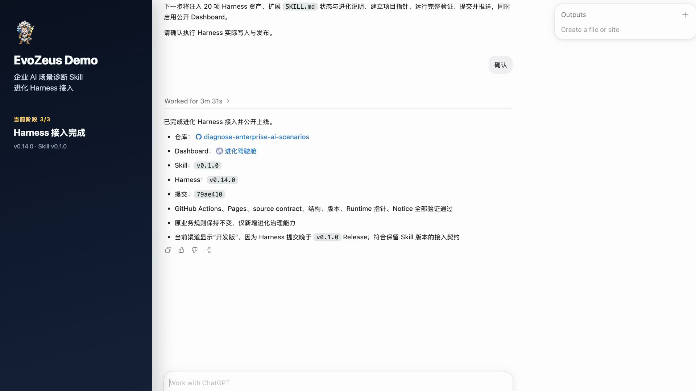
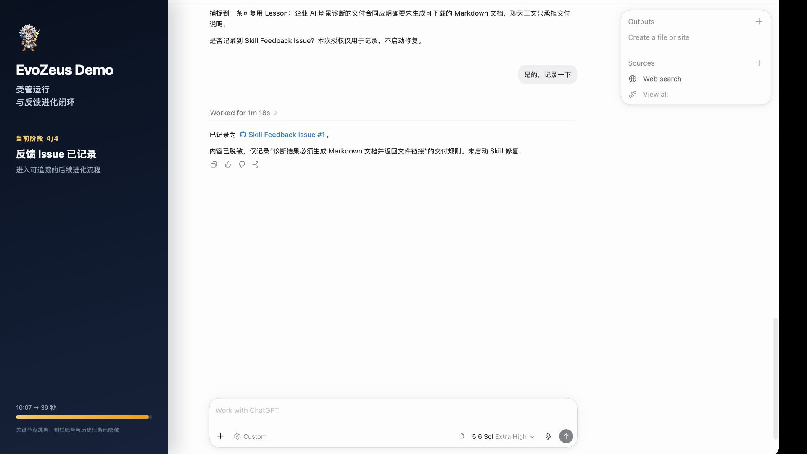

# EvoZeus（宙斯）

**把真实 Agent 工作转化为经过验证的改进。**

[English](../README.md) · [业务演示](#业务演示) · [安装 EvoZeus](#安装-evozeus) · [Demo Skill](#用真实-demo-skill-体验-evozeus) · [工作方式](#工作方式) · [安全边界](#安全边界)

EvoZeus 复盘一次真实 Agent 任务中发生了什么，识别能改善下一次执行的 Lesson，并把用户确认后的变化路由为可复用、可验证、可治理的产物。它适用于 Skill、plugin、Agent workflow 和其他 Skillware 的建设团队。

```text
Agent 工作 → 证据 → 判断 → Lesson → 经过验证的改进
```

## 为什么需要 EvoZeus

团队已经拥有聊天记录、执行日志、代码 diff、错误和用户纠正。真正困难的环节是判断哪些观察值得行动，以及如何证明修改有效。

EvoZeus 提供完整判断闭环：

- 基于证据复盘一次任务或一组会话；
- 区分产品、Skill、环境和执行问题；
- 发现可复用 Lesson 时先询问是否记录；
- 把 Lesson 保存为 Case、规则、习惯、Skill 修改或环境修复；
- 为独立 Skillware Repo 接入可治理的进化生命周期。

## 业务演示

下面两段短视频覆盖一条完整业务闭环：先让已有 Skill 进入可维护的生命周期，再把用户不满意转化为团队可检查、可授权的改进输入。

<table>
  <tr>
    <td width="50%" valign="top">
      <a href="../assets/demos/skill-evolution-harness.mp4">
        
      </a>
      <br>
      <strong>1. 让 Skill 进入受管生命周期</strong><br>
      在保留业务规则的前提下，为独立 Skill Repo 补齐源头、版本、验证、反馈和发布治理。<br>
      <a href="../assets/demos/skill-evolution-harness.mp4">观看 50 秒演示 →</a>
    </td>
    <td width="50%" valign="top">
      <a href="../assets/demos/managed-feedback-loop.mp4">
        
      </a>
      <br>
      <strong>2. 把不满意转化为可追踪改进</strong><br>
      正常聊天保持简洁；发现可复用 Lesson 后先征得授权，再创建可评审的 Feedback Issue，修复仍需独立授权。<br>
      <a href="../assets/demos/managed-feedback-loop.mp4">观看 39 秒演示 →</a>
    </td>
  </tr>
</table>

## 安装 EvoZeus

官网负责完整的安装与注册旅程。在兼容的 Agent 宿主中粘贴下面一行：

```text
加入 EvoZeus: https://evozeus-community.vercel.app/skill
```

[官网 Install Skill](https://evozeus-community.vercel.app/skill) 会依次完成：

1. 解析最新不可变 Stable Release，并校验正式安装包的 SHA-256；
2. 说明将发生的本地写入，在安装和注册前取得用户批准；
3. 安装 Stable，并核验当前渠道、版本、产品清单和 Doctor 结果。

官网是唯一公开安装交接入口，因此 README 不复制第二套安装命令。Stable 健康后，用户可以再单独选择是否进入唯一 UAT。

## 用真实 Demo Skill 体验 EvoZeus

[企业 AI 场景地图 Skill](https://github.com/MetaInFLow/Enterprise-ai-scenario-map-skill) 是理解 EvoZeus 真实用法的业务 Demo。它会调研企业、生成 30 个以上 AI 场景、完成优先级判断并给出落地路径。

```text
使用企业 AI 场景地图 Skill，为一家 B2B 软件服务公司生成标准版 AI 场景地图。
```

沿着一次完整旅程体验 EvoZeus：

| 时刻 | 业务动作 | EvoZeus 动作 |
| --- | --- | --- |
| 1. 运行 | 使用 Demo Skill 生成企业 AI 场景地图 | 展示 EvoZeus 产品渠道并识别目标 Skill；目标 Repo 已接入 Harness 时同步显示其身份 |
| 2. 纠正 | 指出具体问题，例如证据不足或缺少 Markdown 交付文件 | 先完成业务纠正，再总结一条可复用 Lesson |
| 3. 确认 | 决定是否记录这条 Lesson | 只有用户确认后才创建 Skill Feedback Issue |
| 4. 进化 | 单独授权修改目标 Repo | 接入或遵循目标 Repo Harness，让已批准变化进入 Design、PR、验证、UAT 和 Release |

这个 Demo 负责解释产品如何使用；安装和注册始终使用上方官网 `/skill` 入口。

## 开始使用

完成安装后，可以直接表达目标：

```text
复盘这次 Agent 执行，找出值得保留、修复或进化的内容。
```

```text
把这条已确认的 Lesson 保存为可追踪的改进。
```

```text
检查 EvoZeus 的 stable/UAT 状态，并告诉我唯一下一步。
```

EvoZeus 会在正常聊天中给出结果。生命周期事件使用紧凑标记：

```text
🧙 EvoZeus · 捕捉到一条 Lesson｜版本检查不应阻断用户的真实任务。要记录下来吗？
```

正常 Lesson 提示不会输出内部 JSON，用户确认前不会写入记录。

Lesson 检查的启动方式取决于宿主：

| 宿主 | 行为 |
| --- | --- |
| Claude Code plugin | 内置 `SessionStart` 适配器在启动、恢复、清空和压缩后静默加载 Lesson 检查合同；不写入、不显示启动横幅。 |
| Codex plugin | 通过用户显式请求或语义匹配选择 EvoZeus。当前 Codex plugin manifest 没有 session hook，因此不承诺所有聊天自动捕捉。 |

两种宿主都先完成用户任务，再询问是否记录 Lesson。

## 工作方式

1. **复盘**：读取用户放入范围的会话、文件、diff、报告或明确批准的本地来源。
2. **判断**：把发现路由为 Preserve、Promote to Skill、Keep as Habit、Fix Environment、Reject Pattern 或 Open Case。
3. **确认**：发现可复用 Lesson 时，用一句话总结并询问是否记录。
4. **改进**：把确认后的 Lesson 转化为可检查产物；独立 Skillware Repo 可接入 [EvoZeus CoEvolve](https://github.com/MetaInFLow/EvoZeus-CoEvolve)。

## 产品包含什么

EvoZeus 是一个本地产品和一个版本化发布：

| 能力面 | 作用 |
| --- | --- |
| Agent plugin | 自然语言入口与任务路由 |
| 用户 Skills | 复盘、Lesson 记录、Repo 进化、版本维护 |
| 产品 CLI | Stable/UAT 对齐、Doctor、更新与回滚 |
| 内置 Runtime | 本地证据处理与报告 |
| 内置 Session Signal pack | 官方复盘信号与 Factor tools |
| 可选 CoEvolve | 独立 Skillware Repo 的进化生命周期 |

Runtime 与 Session Signal 是主仓内部模块，随 EvoZeus 产品版本一起发布，用户无需分别升级。

## Stable 与唯一 UAT

- `stable` 是不可变正式 Release。
- `uat` 是唯一可覆盖的测试候选。
- UAT 修复覆盖当前候选，不产生第二个用户可见 UAT。
- Stable 与 UAT 的代码和本地状态隔离。
- 正式发布使用已经验证的同一份 UAT 源码。

## Repo 进化边界

进化 Harness 的治理单位是 Git Repo，因为 Issue、PR、Owner、UAT、Release 和回滚都在这个边界上发生。

- 一个独立 Git Repo 最多拥有一个根 Harness；
- package、pack、app 和 Skill 目录继承所在 Repo Harness；
- CI 拒绝嵌套 Harness；
- Harness 升级和推送需要目标 Repo 已验证的 `ADMIN` 权限。

完整规则见 [Harness 边界策略](governance/harness-boundary-policy.md)。

## 安全边界

- raw private session 默认保留在本地。
- 不自动上传会话。
- 持久化写入、GitHub 修改、安装、更新和外部上传前需要确认。
- 公开产物必须移除 secret、客户数据、私有路径、无关身份和未发布代码。
- 运行历史 Skill 不会静默覆盖 Stable 安装。

## 维护者入口

- [架构与迁移设计](design/active/design_doc-v0.5-plugin-monorepo.md)
- [Repo 拓扑](governance/repository-topology.md)
- [发布策略](governance/release-and-promotion-policy.md)
- [Plugin 用户入口](../skills/using-evozeus/SKILL.md)
- [维护者 Skills](../maintainer/skills/index/SKILL.md)
- [贡献指南](../CONTRIBUTING.md)

## 相关 Repo

- [MetaInFlow/EvoZeus-CoEvolve](https://github.com/MetaInFLow/EvoZeus-CoEvolve)：面向独立 Skillware Repo 的可选进化扩展与 Harness SDK。
