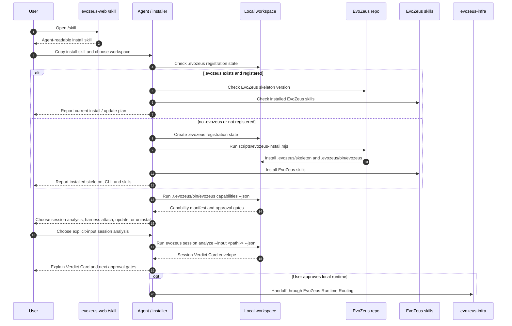

<h1 align="center">
  &nbsp;&nbsp;EvoZeus（宙斯）&nbsp;&nbsp;
</h1>

<p align="center">
  <a href="../README.md">English</a> · <strong>简体中文</strong>
</p>

<p align="center">
  
</p>

<p align="center">
  <a href="#start-here">Start Here</a> ·
  <a href="#what-evozeus-manages">Managed Assets</a> ·
  <a href="#use-paths">Use Paths</a> ·
  <a href="#contribution-quick-path">Contribution</a> ·
  <a href="#docs-by-goal">Docs by Goal</a> ·
  <a href="README.md">Full Docs</a>
</p>

##  把 Agent Session 放上审判台。

**什么该沉淀，什么该修正，什么该淘汰，由证据决定。**

EvoZeus（宙斯）是 Agent Session 的审判层。它不做 Agent 打分，也不把 Skill 当作唯一目标；它管理真实 session 里产生的证据、Case、Verdict 和最终沉淀资产。

EvoZeus 也定义一种新的软件范式：**Skill Driven Software（SDS）**。在 SDS 中，软件行为由 code、scenario skill、factor、rule、report 和 runtime 共同驱动。

> Origin：宙斯的概念诞生于一次不太成功的黑客松之后，[Anthony](https://github.com/HaodiFan) 和 [Neil](https://github.com/orgs/MetaInFLow/people/Neillan96) 两个人的一次复盘。

##  Start Here

把这句话复制给你的 Agent：

```text
运行 ./.evozeus/bin/evozeus capabilities --json，展示当前可用的 EvoZeus 功能，然后询问用户要走哪条路径。除非用户明确批准具体动作，否则不要扫描本地 session、写本地文件或提交 GitHub。
```

如果你来自 `https://evozeus-community.vercel.app/skill`，那一步是 agent-readable install skill handoff：用户把 install skill 复制给本地 agent；agent 先读 [EvoZeus-Install Registration](../skills/evozeus-install-registration/SKILL.md)，询问本地写入批准后，安装或修复 `.evozeus/skeleton`、`.evozeus/bin/evozeus` 和 EvoZeus skills。runtime、默认 official factors、本地扫描、报告文件、wrapper 写入和 GitHub 贡献都必须等用户明确批准。

##  Registration / Install Sequence

Web `/skill` 返回 install skill，不直接运行 judgment、runtime 或 static Skill wrapping。安装必须同时安装协议 skeleton、本地 CLI 和 EvoZeus skills。EvoZeus 是用户安装后的母体和调度层；component repo 是它在用户批准后调用的能力。


```mermaid
sequenceDiagram
  autonumber
  participant User
  participant Community as evozeus-web /skill
  participant Installer as Agent / installer
  participant Local as Local workspace
  participant Main as EvoZeus repo
  participant Skills as EvoZeus skills
  participant Runtime as evozeus-infra

  User->>Community: Open /skill
  Community-->>User: Agent-readable install skill
  User->>Installer: Copy install skill and choose workspace
  Installer->>Local: Check .evozeus registration state

  alt .evozeus exists and registered
    Installer->>Main: Check EvoZeus skeleton version
    Installer->>Skills: Check installed EvoZeus skills
    Installer-->>User: Report current install / update plan
  else no .evozeus or not registered
    Installer->>Local: Create .evozeus registration state
    Installer->>Main: Run scripts/evozeus-install.mjs
    Main->>Local: Install .evozeus/skeleton and .evozeus/bin/evozeus
    Installer->>Skills: Install EvoZeus skills
    Installer-->>User: Report installed skeleton, CLI, and skills
  end

  Installer->>Local: Run ./.evozeus/bin/evozeus capabilities --json
  Local-->>Installer: Capability manifest and approval gates
  Installer-->>User: Choose session analysis, harness attach, update, or uninstall
  User->>Installer: Choose explicit-input session analysis
  Installer->>Local: Run evozeus session analyze --input <path|-> --json
  Local-->>Installer: Session Verdict Card envelope
  Installer-->>User: Explain Verdict Card and next approval gates

  opt User approves local runtime
    Installer->>Runtime: Handoff through EvoZeus-Runtime Routing
  end
```

| Step | 当前状态 |
| --- | --- |
| Web `/skill` | 返回 agent-readable install skill |
| `.evozeus` registration | 已存在时先检查是否已注册 |
| EvoZeus install | 安装 protocol skeleton、本地 CLI 和 EvoZeus skills |
| Capability router | 安装后先用 `capabilities --json` 展示功能和审批边界 |
| Explicit-input session analysis | 只分析用户显式传入的 session，不默认扫描本地 runtime |
| Runtime approval | 本地扫描、runner、report execution 都必须另行批准 |

##  What EvoZeus Manages

软件开发管理 `code -> issue -> PR -> review -> merge`。

宙斯管理：

```text
Session -> Evidence -> Case -> Verdict -> Artifact -> Library
```

| Term | 中文名 | Meaning |
| --- | --- | --- |
| Session | 会话 | 一次真实 Agent 执行 |
| Evidence | 证据 | 支撑判断的最小证据 |
| Case | 案件 | 等待审判的发现 |
| Verdict | 裁决 | 基于 Evidence 对 Case 给出的结果 |
| Artifact | 沉淀资产 | Verdict 落成后的可执行或可复用资产 |
| Library | 资产库 | 可复用的公共资产集合 |

Verdict（裁决）需要落成 Artifact：

| Verdict | Artifact |
| --- | --- |
| `Promote to Skill` | Skill |
| `Extract Factor` | Factor |
| `Keep as Habit` | Habit |
| `Fix Environment` | Environment Rule |
| `Reject Pattern` | Rejected Pattern |
| `Preserve` | Accepted Case |
| `Open Case` | Pending Case |

##  Use Paths

EvoZeus 现在首先是一个 **install skill + local CLI-first agent surface**。README 只给最短路径；完整规则在 docs 和 skills 里。

| Goal | Start here | Output |
| --- | --- | --- |
| 注册并安装 EvoZeus | [EvoZeus-Install Registration](../skills/evozeus-install-registration/SKILL.md) | `.evozeus` 注册状态、skeleton、CLI、skills inventory |
| 选择 EvoZeus 功能 | `./.evozeus/bin/evozeus capabilities --json` | capability manifest 和 approval gates |
| 分析一次 Agent Session | `./.evozeus/bin/evozeus session analyze --input <path|-> --json` | Session Verdict Card envelope |
| 给对象接协同进化 harness | `./.evozeus/bin/evozeus harness attach --target <path|url> --json` | wrapper handoff plan |
| 选择具体工作场景 | [EvoZeus-Skill Index](../skills/index/SKILL.md) | `EvoZeus-Development` / `EvoZeus-Community Contribution` / `EvoZeus-Reporting` / `EvoZeus-Runtime Routing` |
| 开发 EvoZeus 本身 | [EvoZeus-Development](../skills/evozeus-development/SKILL.md) | 小范围 issue/branch/PR |
| 贡献 Case 或 Candidate | [CONTRIBUTING.md](../CONTRIBUTING.md) | redacted Case / Candidate PR |
| 审查 PR 规范 | [docs/governance/pr-guidelines.md](governance/pr-guidelines.md) | proof-backed PR |
| 理解核心语义 | [docs/reference/ontology.md](reference/ontology.md) | Candidate / Evidence / Verdict 边界 |

##  Safety Defaults

EvoZeus 的默认路径是低权限、可审查、可撤回的。

- **Zero-install entry**：读取 `SKILL.md` 不应安装任何包。
- **Capability first**：安装后的第一步是 `capabilities --json`，不是静默扫描或写入。
- **Local-first evidence**：raw session 默认只留在本地，不进入公共 PR。
- **Redacted public artifacts**：公开 Case、Candidate、Report 必须先脱敏。
- **Markdown/JSON first**：基础报告和 schema 不依赖 dashboard、scanner 或云服务。
- **Opt-in runtime packs**：scanner、factor code、MCP、LLM、可视化包必须按需启用。
- **User-approved contribution**：只有用户确认后，才检查 `gh` 并创建 issue / PR。

##  Contribution Quick Path

主路径是 agent-assisted，但合并权仍归 maintainer：

```text
Local Evidence Report -> Agent Review -> Case Draft -> User Approval -> PR -> Maintainer Review
```

开发或 PR 前先运行：

```bash
python3 scripts/check_pr_ready.py
git diff --check
```

最小 Case：

```yaml
session_id: redacted-session-id
agent_runtime: codex | claude | cursor | other
case_type: preserve | promote | fix | reject | open
evidence: redacted command output, diff, tool trace, or report excerpt
proposed_verdict: Preserve | Promote to Skill | Extract Factor | Keep as Habit | Fix Environment | Reject Pattern | Open Case
privacy_note: what was removed or generalized
```

GitHub automation is dry-run by default: labeler、proof gate、privacy scan、dirty PR check、queue guard 和 Candidate schema check 可以打 label 和更新 marker comment，但不会 approve、merge、promote core Candidate 或自动关闭 PR。

##  Docs by Goal

| Need | Read |
| --- | --- |
| 文档总入口 | [docs/README.md](README.md) |
| Evidence 等级 | [docs/reference/evidence-grading.md](reference/evidence-grading.md) |
| Review contract | [docs/reference/review-contract.md](reference/review-contract.md) |
| Verdict 类型 | [docs/reference/verdicts.md](reference/verdicts.md) |
| Verdict Card | [docs/reference/verdict-card.md](reference/verdict-card.md) |
| 报告模板 | [docs/reference/report-templates.md](reference/report-templates.md) |
| Candidate Schema | [schemas/candidate.schema.json](../schemas/candidate.schema.json) |
| 隐私与脱敏 | [docs/governance/privacy-and-redaction.md](governance/privacy-and-redaction.md) |
| PR 分流状态机 | [docs/governance/pr-routing-policy.md](governance/pr-routing-policy.md) |
| Factor registry 治理 | [docs/governance/factor-registry-governance.md](governance/factor-registry-governance.md) |
| 上线评判标准 | [docs/governance/launch-readiness-criteria.md](governance/launch-readiness-criteria.md) |
| Labels 与 protected paths | [docs/governance/labels.md](governance/labels.md), [docs/governance/protected-paths.md](governance/protected-paths.md) |

##  What Exists Today

| Area | Status |
| --- | --- |
| Protocol Surface | `SKILL.md`、场景 skills、Verdict、Case 模板、隐私门禁 |
| Ontology Layer | Candidate taxonomy、evidence grading、negative patterns、review contract |
| Developer Workflow | branch 规范、PR 模板、dry-run governance gates、pre-submit checks |
| Public Examples | redacted Case、Evidence Report、valid/invalid Candidate examples |
| Factor Surface | 公开 Factor Candidate 入口和 registry pointer；可执行 packs 不放在本 repo |

Planned but not stable yet:

- Local Runtime：`.evozeus/` 本地状态、SQLite registry、Markdown/JSON report
- Community Library：Cases、Factor references、Habits、Environment Rules、Rejected Patterns
- CLI / TUI / browser companion

Not promised:

- 自动上传 raw session
- 默认安装 scanner / chart / MCP / cloud client
- 自动创建 PR
- 大规模 benchmark

##  License

MIT. See [LICENSE](../LICENSE).
