# 项目地图：Scope 和组件

- Status: active
- Last updated: 2026-06-15
- Audience: 想看清项目边界的人

## 总览

EvoZeus 首期可以拆成五个大 scope：

```mermaid
flowchart TB
  root["EvoZeus"]
  root --> infra["Infra"]
  root --> judgment["Judgment"]
  root --> skills["Scenario Skills"]
  root --> factor["Factor Runtime + Library"]
  root --> community["Community"]

  infra --> tui["TUI"]
  infra --> companion["Browser Companion"]
  infra --> workspace["Local Workspace"]
  infra --> doctor["Doctor / Status"]

  judgment --> evidence["Evidence"]
  judgment --> case_node["Case"]
  judgment --> verdict["Verdict"]
  judgment --> artifact["Artifact"]

  skills --> skill_index["Skill Index"]
  skills --> skill_packages["Skill Packages"]
  skills --> skill_gate["Download Gate"]
  skills --> skill_proposal["Skill Proposal"]

  factor --> framework["Analysis Framework"]
  factor --> factors["Factors"]
  factor --> results["Factor Results"]
  factor --> registry["Factor Registry"]

  community --> issues["Case Issues"]
  community --> prs["Rule / Factor PRs"]
  community --> golden["Golden Cases"]
  community --> history["Contribution History"]
```



## 1. Infra

Infra 负责让用户和 Agent 低成本进入 EvoZeus。

| Component | Purpose |
| --- | --- |
| TUI | 首期主交互界面 |
| Browser Companion | 需要真人 insight、脱敏预览、贡献确认时打开 |
| Local Workspace | `.evozeus/` 本地状态、报告、缓存 |
| Doctor / Status | 检查本地环境、依赖、因子库状态 |

Infra 的默认策略是 manual、local-first、opt-in。hook、cron、社区 registry、上传动作都需要后续确认。

## 2. Judgment

Judgment 负责把一次 Agent session 变成可判断、可复用、可贡献的结构化结果。

| Component | Purpose |
| --- | --- |
| Evidence | 从 session 中抽取最小证据 |
| Case | 对一次发现建立可讨论对象 |
| Verdict | 判断这个 Case 的去向 |
| Artifact | 把 Verdict 落成 Skill、Factor、Habit、Rule 或 Pattern |

Judgment 的价值在于让“这次为什么失败、为什么延后、为什么效果很好”变成可沉淀资产。

## 3. Scenario Skills

Scenario Skills 负责把不同场景下的 Agent 行动方式做成可下载、可版本化、可回滚的 package。

| Component | Purpose |
| --- | --- |
| Skill Index | 根路由，告诉 Agent 当前场景该建议哪个 skill |
| Skill Package | 某个场景下的 Agent 行动规范 |
| Download Gate | 下载或启用前展示依赖、权限、输入输出和回滚 |
| Skill Proposal | 从重复纠偏或高质量 adhoc 结果中提出候选 skill |

Scenario Skills 是 Skill Driven Software 的行动层。它不默认安装，只在场景匹配且用户确认后启用。

## 4. Factor Runtime + Library

Factor Runtime + Library 负责把分析框架和因子绑定起来。

| Component | Purpose |
| --- | --- |
| Analysis Framework | 定义一次 session 分析要经过哪些 stage |
| Factor | 在某个 stage 上运行的判断逻辑 |
| Factor Result | 因子的稳定输出格式 |
| Factor Registry | 本地或社区因子库索引 |

Factor 可以是轻量规则，也可以是后续按需安装的重因子。首期默认因子应该轻、可解释、可禁用、可回滚。

## 5. Community

Community 负责接收经过脱敏和用户确认的贡献。

| Component | Purpose |
| --- | --- |
| Case Issues | 接收 Scenario + Evidence + Proposed Verdict |
| Rule / Factor PRs | 把稳定贡献合入公共资产 |
| Golden Cases | 沉淀高质量历史贡献 |
| Contribution History | 让用户和 Agent 查到社区已经接受过什么 |

社区资产的核心形态是 graph：Scenario、Rule、Factor、Persona Signal、Domain Signal 等节点可以相连。

## Scope 之间的链路

```text
Infra 让用户和 Agent 进入系统
-> Judgment 形成 Evidence / Case / Verdict
-> Scenario Skills 提供场景化行动方式
-> Factor Runtime 提供可解释分析能力
-> Community 沉淀可复用公共资产
-> Agent 下次引用本地或社区资产
```
