# Factor Registry Governance

- Status: draft
- Last updated: 2026-06-18
- Decision: [ADR-0002](../decisions/ADR-0002-factor-pack-registry-and-community-promotion.md)

本文定义社区共创下 Factor 和 scanner module 从上传、审核到上线的链路。这里的上线不是 PR merge，而是进入主 registry 后可被默认搜索和按需安装。

## 1. Core Principle

社区可以高频提交，官方上线必须低频、可审计、可回滚。

EvoZeus 主仓库只负责：

- Factor 协议和 schema
- 最小 builtin Factors
- 官方 registry
- installer 和 runtime 的约束规则
- governance 文档

lab repo 负责：

- 社区投稿入口
- Candidate 孵化
- 自动校验
- rejected / reviewed 记录
- reviewed metadata and promotion packets

official Factor pack repo 负责：

- maintainer-promoted packs
- GitHub Releases
- checksums
- SBOM
- artifact attestation
- deprecation / yanking records

## 2. Asset Types

| Asset | Meaning | Review focus | Risk |
| --- | --- | --- | --- |
| `factor.yaml` | 判断规则、触发条件、证据要求、正反例 | 语义、证据、ontology fit、隐私 | Medium |
| `bundle` | 一组相关 Factors | 组合边界、依赖、命名、版本 | Medium |
| `scanner module` | 可执行扫描模块 | 权限、依赖、沙箱、确定性、供应链 | High |
| `factor pack` | 可发布和安装的集合 | manifest、兼容性、checksum、release | High |

任何包含 scanner module 的贡献都必须走 high-risk gate。不能把 scanner module 当作普通文档或普通 Factor metadata 审核。

## 3. Repository Roles

```text
EvoZeus main repo
  factors/
    README.md
    builtin/
    registry/

evozeus-factor-lab
  submissions/
  candidates/
  reviewed/
  rejected/
  releases/

evozeus-factors-official
  packs/
  dist/
  releases/
```

主 registry 只保存 release 引用，不复制全量 Factor pack 内容。

Example registry entry:

```json
{
  "id": "evozeus-core",
  "source": "github-release",
  "repo": "MetaInFLow/evozeus-factors-official",
  "tag": "core-v0.2.0",
  "manifest": "https://raw.githubusercontent.com/MetaInFLow/evozeus-factors-official/core-v0.2.0/dist/factor-index.json",
  "checksum": "sha256:...",
  "channel": "stable",
  "review_state": "approved",
  "attested": true
}
```

## 4. End-to-end Flow

```mermaid
flowchart LR
  A["Contributor"] --> B["Issue / Discussion<br/>problem, evidence, scenario"]
  B --> C["PR to factor lab<br/>submissions/author/factor-id"]
  C --> D["Automated gates<br/>schema / privacy / secret / license"]
  D --> E{"Contains scanner code?"}

  E -- "No" --> F["Factor Review<br/>semantics, evidence, reuse"]
  E -- "Yes" --> G["Security CI<br/>lockfile, static analysis, sandbox, determinism"]
  G --> H["Security Review<br/>permissions, deps, outputs"]

  F --> I{"Approved?"}
  H --> I

  I -- "No" --> J["Rejected Record<br/>negative pattern or revision request"]
  I -- "Yes" --> K["Reviewed Candidate<br/>maintainer sandbox only"]

  K --> L["Promotion PR<br/>to official Factor pack repo"]
  L --> M["Official CI<br/>manifest, hashes, compatibility"]
  M --> N["CODEOWNERS + Maintainer Approval"]
  N --> O["Merge to official repo"]

  O --> P["Tag<br/>versioned release"]
  P --> Q["GitHub Release<br/>index, checksums, SBOM, attestation"]

  Q --> R["Registry PR<br/>to EvoZeus main registry"]
  R --> S["Registry CI<br/>schema, checksum, provenance"]
  S --> T["Maintainer Review"]
  T --> U["Registry Published<br/>stable channel"]

  U --> V["User search / list"]
  V --> W["Selective install<br/>factor, bundle, or pack"]
  W --> X["Local lockfile<br/>.evozeus/infra/lockfile.json"]
  X --> Y["Runtime executes by manifest permissions"]
```



## 5. Submission Packet

A lab repo submission should use this shape:

```text
submissions/{author}/{factor-id}/
  factor.yaml
  scanner/
    scanner-manifest.json
    src/
    tests/
    fixtures/
  EVIDENCE.md
  PRIVACY.md
  LICENSE
```

`scanner/` is optional. If it exists, the PR must be labeled as scanner code and routed through security review.

Minimum `EVIDENCE.md`:

```text
Source Case or Session:
Evidence grade:
Observed signals:
Positive examples:
Negative examples:
When not to use:
Failure mode prevented:
Limitations:
```

Minimum `PRIVACY.md`:

```text
Private data removed:
Private data generalized:
Remaining public evidence:
Why this can be reviewed without raw session access:
```

## 6. Scanner Manifest

Scanner modules must declare runtime and permissions.

```json
{
  "id": "privacy-risk-scanner",
  "runtime": "node",
  "entrypoint": "src/index.js",
  "permissions": {
    "network": false,
    "filesystem": "read-only",
    "env": [],
    "max_runtime_ms": 3000,
    "max_output_bytes": 200000
  },
  "outputs": ["tags", "evidence_refs"],
  "dependencies": {
    "lockfile_required": true
  }
}
```

Default rule: undeclared permission means no permission.

## 7. Automated Gates

Every submission PR should run:

```text
schema-check
privacy-scan
secret-scan
license-check
dependency-lock-check
static-analysis
unit-test
fixture-test
sandbox-run
determinism-check
manifest-hash-check
```

For fork PRs:

- `pull_request` may run untrusted code only with read-only token and no secrets.
- `pull_request_target` may label or comment, but must not checkout or execute untrusted PR head code.
- Jobs that publish releases, update registry, or use write credentials must run only after maintainer-controlled promotion.

## 8. Review Roles

| Role | Required for | Review responsibility |
| --- | --- | --- |
| Factor reviewer | `factor.yaml`, bundle | evidence, ontology fit, trigger clarity, negative examples |
| Security reviewer | scanner module | permissions, dependencies, sandbox behavior, output boundary |
| Maintainer | official promotion and registry publication | channel, release, rollback path, community impact |

CODEOWNERS and repository rulesets should require the matching reviewer before merge to protected branches.

## 9. Promotion Rules

Promotion is separate from submission.

```text
lab PR merge
  -> reviewed candidate
  -> promotion PR to official pack repo
  -> official release
  -> registry PR to main repo
  -> stable channel
```

Promotion requires:

- schema-valid manifest
- evidence grade appropriate to target channel
- privacy note
- scanner permission declaration if code is included
- tests over redacted fixtures
- checksum generation
- deprecation or yanking path
- maintainer approval

## 10. Main Registry Intake

The main registry must not crawl `main` branches from lab repos.

Allowed intake:

- a trusted lab or official repo in an allowlist
- GitHub tag or commit SHA
- release manifest
- checksum
- channel
- review state
- optional artifact attestation

Registry CI should verify:

```text
[ ] repo is allowlisted
[ ] tag or commit matches the manifest
[ ] manifest schema is valid
[ ] checksum matches downloaded manifest
[ ] factor and scanner paths are immutable for the selected version
[ ] scanner permissions are within channel policy
[ ] release is not deprecated or yanked
[ ] attestation exists when required by channel
```

## 11. Channels

| Channel | Source | User install behavior |
| --- | --- | --- |
| `stable` | main registry approved release | visible by default |
| `reviewed` | reviewed lab release | maintainer sandbox only; ordinary runtime install must wait for official promotion |
| `community` | third-party or lab source | requires explicit community flag |
| `local` | local workspace path | never auto-updated |
| `deprecated` | old but still reproducible | warning before install |
| `yanked` | withdrawn for safety or correctness | blocked unless lockfile reproduction is explicitly requested |

Default search should show `stable` only. Other channels require explicit opt-in.

## 12. Install and Lockfile Implications

Selective install should follow this order:

```text
fetch registry entry
-> fetch release manifest
-> choose factor / bundle / pack
-> resolve dependencies
-> download selected files only
-> verify checksums
-> write .evozeus/infra/lockfile.json
```

The lockfile should record:

```json
{
  "factors": {
    "evozeus-core/privacy-risk": {
      "repo": "MetaInFLow/evozeus-factors-official",
      "tag": "core-v0.2.0",
      "commit": "abc123",
      "path": "factors/privacy-risk/factor.yaml",
      "sha256": "..."
    }
  }
}
```

Runtime must execute scanner modules according to their manifest permissions, not according to contributor trust.

## 13. Deprecation and Yanking

Deprecation is for outdated, replaced, or no-longer-recommended assets. Yanking is for safety, privacy, correctness, or supply-chain risk.

Yanking should update:

- release notes or advisory
- registry entry state
- replacement recommendation if available
- installer warning or block rule
- negative pattern or rejected record when useful

Existing lockfiles may preserve reproducibility, but new installs should not select yanked assets by default.
